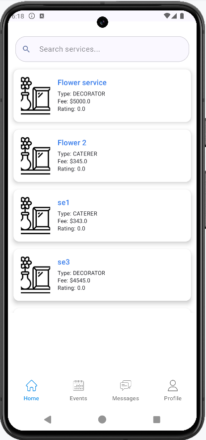
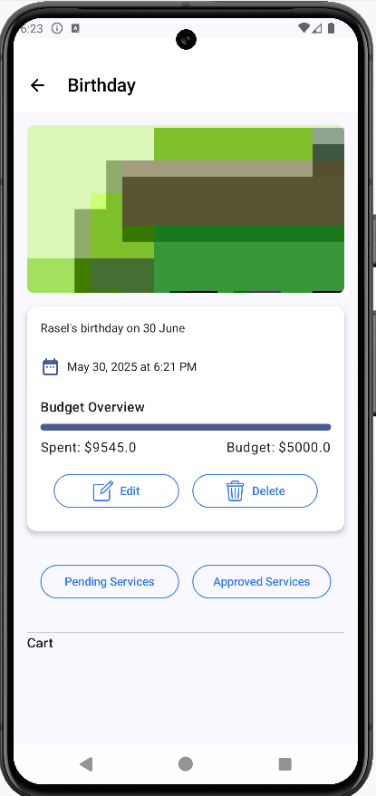
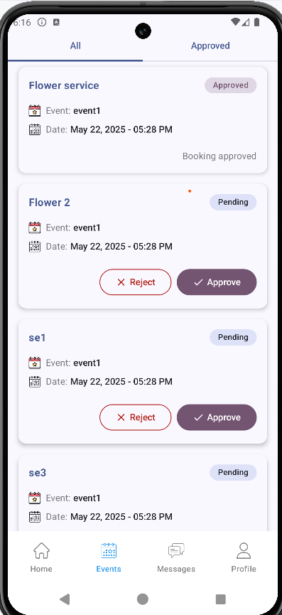

# EventHub - Android App

**EventHub** is a modern event management Android application built using **Kotlin** and **Jetpack Compose**. It enables users to create and manage events efficiently, while service providers can offer and manage services related to these events.

## 📱 Features

### 🔐 Authentication
- Login and Registration (via secure backend API)

### 📅 Event Management (General Users)
- Create and delete events with fixed dates
- View a list of upcoming and past events
- Add services to specific events

### 🛠️ Service Management (Service Providers)
- Create and delete services for sale
- View service requests from users
- Approve or reject service booking requests

### 💰 Service Booking
- General users can browse and purchase services
- Booking status is updated upon approval/rejection

---

## 📸 Screenshots

| Login Screen | Home Screen | Event Details | Booking Approval |
|--------------|-------------|----------------|------------------|
|  |  |  |  |
[🔗 View more screenshots](./screenshots/)

---

## 🛠️ Tech Stack

- **Language**: Kotlin
- **UI**: Jetpack Compose
- **Architecture**: MVVM
- **State Management**: State Hoisting + ViewModel
- **Network**: Retrofit (based on version)
- **Dependency Injection**: Koin
- **Data Storage**: SharedPreferences
- **Navigation**: Jetpack Navigation Component

---

## 🧪 Testing & Validation

- Tested with various use cases including:
  - Event-service mapping
  - API failure handling
  - Service approval/rejection flow
  - Session persistence with JWT token

---

## 🚀 Future Improvements

- Push notifications for booking status updates
- Calendar view integration for event scheduling
- Chat module between users and providers
---

## 🌐 Backend Repository

You can find the custom backend implementation for EventHub here:  
🔗 [EventHub Backend (Ktor)](https://github.com/niloy32073/eventhub)

---

## 📧 Contact

**Md Rasel Rahman**  
📍 Jashore, Bangladesh  
📫 [LinkedIn](https://www.linkedin.com/in/rasel093/) | [GitHub](https://github.com/rasel-093)
